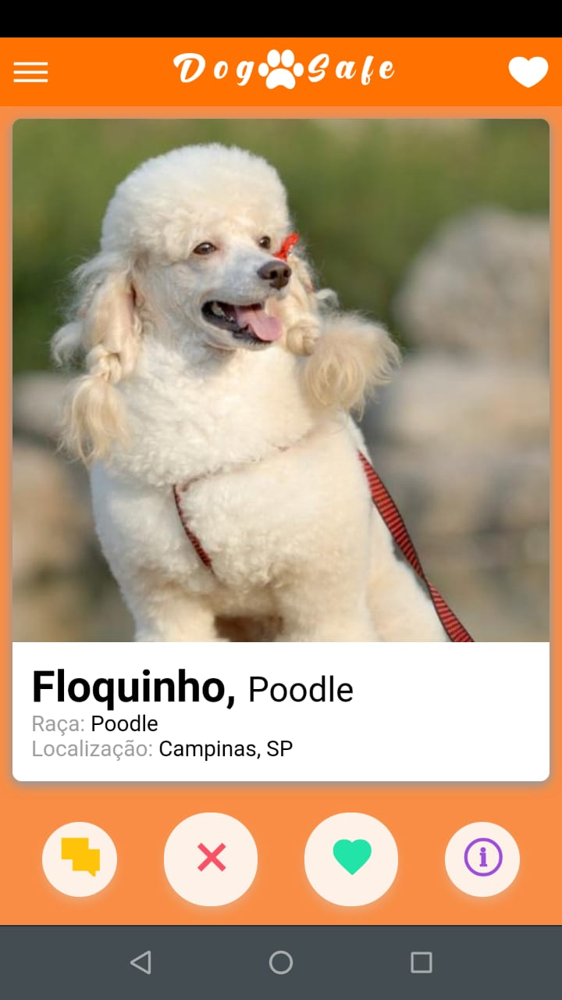

「Dog Safe - Aplicativo para seu Pet」
=======


Dogsafe o aplicativo ideal para achar o par ideal do seu Pet. Desenvolvido para a Grupo do Curso de Administração da Universidade de Guarulhos, apresentado na feira de empreendorismo da Universidade de Guarulhos. 

  - Desenvolvido em Ionic 2

Screenshots
<br>





### Installation

Dogsafe requer [Node.js](https://nodejs.org/).

Instalação do ambiente.

```sh
$ npm install -g cordova
$ npm install -g ionic@3.19.0
$ npm install
```

Run

```sh
ionic serve
```
Licença
----

MIT

